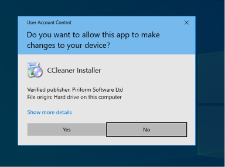

# nsis-dll-hijack-poc

## Overview

Software installers are trusted executables that run with user privileges and perform numerous file operations before installation completes. The **Nullsoft Scriptable Install System (NSIS)** is a popular open-source installer framework used by many applications, including CCleaner.

During installation, NSIS extracts plugin DLLs into temporary directories (e.g., `%LOCALAPPDATA%\Temp\nsXXXXX.tmp`). These DLLs are then loaded by the installer via standard Windows module loading. NSIS plugins must export specific functions (e.g., `Create`, `Show`) that the installer calls during runtime.

This PoC demonstrates how an attacker can hijack this process by:

1. Pre-positioning a proxy DLL named `nsDialogs.dll` in the same directory as the installer
2. Monitoring for the creation of the temporary `ns*.tmp` folder
3. Copying the proxy DLL along with the original DLL into the temp folder before the installer loads it
4. The proxy DLL executes custom code (e.g., MessageBox) while forwarding legitimate calls to the original, renamed DLL (`msvcrt_original.dll`)

This allows arbitrary code execution with the installer's privileges while maintaining normal installer functionality – making it difficult for users to detect any anomaly.


## Repository Structure

```text
├──  README.md
├── ccsetup564.exe             # Legitimate NSIS installer
├── launch.wsf                 # WSF launcher script
├── msvcrt_original.dll        # Legitimate nsDialogs.dll (renamed for stealth)
├── nsDialogs.cpp              # Proxy DLL Source Code (custom Create export with MessageBox, forwards other exports to msvcrt_original.dll)
├── nsDialogs.def              # Module-definition file (exports Create @1)
├── nsDialogs.dll              # Compiled Proxy DLL
└── screenshots/
```

## How It Works?

```text
User double-clicks update.wsf
        │
        ▼
update.wsf launches ccsetup564.exe
        │
        ▼
User approves UAC prompt
        │
        ▼
NSIS creates nsXXXXX.tmp folder
        │
        ▼
update.wsf detects folder (created within last 60 secs)
        │
        ▼
Copies nsDialogs.dll → temp folder
Copies msvcrt_original.dll → temp folder
        │
        ▼
User clicks "Install"
        │
        ▼
Windows loads nsDialogs.dll from temp
        │
        ▼
Proxy DLL executes with installer privileges
        │
        ▼
Installation completes
```

## Quick Setup

1. Clone or download the repository
2. Place all files in same folder
3. Double-click `update.wsf`
4. Click "Yes" on UAC prompt
5. Click "Install" → your proxy DLL loads
6. CCleaner Installation Completed

## Screenshots



*CCleaner installer running after UAC approval*

## Disclaimer

This repository is provided solely for educational purposes, reverse engineering research, and defensive security validation within authorized laboratory environments.

The code and documentation are intended to help security professionals better understand Windows installer internals and improve defensive telemetry. They are not intended for unauthorized use against systems you do not own or have permission to test.
